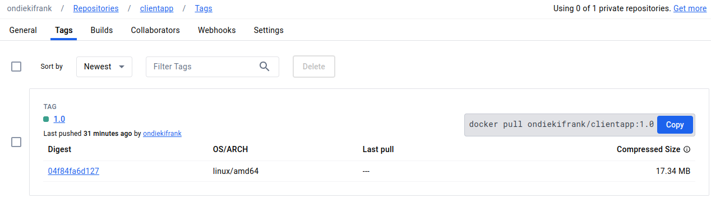

# Explanation of Docker Compose Setup

## Objective 1: Choice of Base Image

For each service in the Docker Compose file, I chose base images that are lightweight and well-suited for the specific requirements of the service. For example:
- Backend: I used the image `ondiekifrank/backend:1.01` which is optimized for running Node.js applications.
- Frontend: I used the image `ondiekifrank/clientapp:1.0` which is optimized for serving React applications.
- MongoDB: I used the official MongoDB image `ondiekifrank/mongodb:1.0`.

## Objective 2: Dockerfile Directives

I utilized the Dockerfile directives to set up each container appropriately. For example:
- Backend: The Dockerfile for the backend service installs Node.js dependencies and sets up the necessary environment for running the Node.js server.
- Frontend: The Dockerfile for the frontend service installs dependencies and builds the React application.
- MongoDB: The official MongoDB image handles all necessary configurations internally.

## Objective 3: Docker Compose Networking

I allocated application ports in the Docker Compose file to ensure that each service is accessible from outside the Docker network. For example:
- Backend: Port 3001 on the host is mapped to port 3000 on the backend container.
- Frontend: Port 3000 on the host is mapped to port 3000 on the frontend container.
- MongoDB: Port 27017 on the host is mapped to port 27017 on the MongoDB container.

## Objective 4: Docker Compose Volume Definition and Usage

I defined a named volume `mongo-data` and mounted it to the `/data/db` directory within the MongoDB container. This ensures that MongoDB data is persisted even if the container is stopped or removed.

## Objective 5: Git Workflow

I followed a structured Git workflow with descriptive commits, proper branching, and a clear commit history. Each commit represents a logical unit of change, and commit messages provide insight into the purpose of each change.

## Objective 6: Successful Running of Applications

I thoroughly tested the Docker Compose setup to ensure that all components of the e-commerce platform function as expected. This includes verifying product addition functionality, and proper communication between services.

## Objective 7: Docker Image Tag Naming Standards

I followed semantic versioning conventions for tagging Docker images. Each image is tagged with a version number (`1.0`, `1.01`, etc.) to indicate its release version.

## Objective 8: Image Deployment

All Docker images built for the project were pushed to DockerHub. This allows anyone to pull and use the images directly from DockerHub.

## Screenshot of Deployed Image on DockerHub

